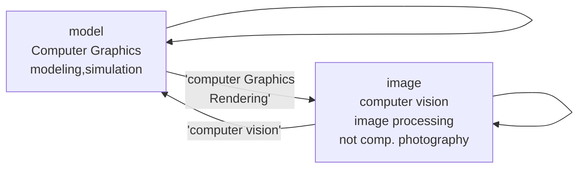

# Modern Graphics

## Course Topics

- Rasterization
  - Project geometry primitives (3D triangles/polygons) onto the screen
  - Break projected primitives into fragments (pixels)
  - Gold standard in video games (ream-time applications)
- Curves and Meshes
  - How to represent geometry in computer graphics
    - Bezier Curve
    - Catmull-Clark subdivision
- Ray Tracing
  - shoot rays from the camera though each pixel
    - calculate intersection and shading
    - continue to bounce the rays till they hit light sources
  - gold standard in animations/movies (off-line application)
- Animation/Simulation
  - key frame animation
  - mass-spring system

### Relations between computer graphics and computer vision?

## A Swift and Brutal Introduction to Linear Algebra

### Graphics' Dependencies

- Basic mathematics
  - Linear algebra,calculus,statistics
- Basic physics
  - optics, mechanics
- Misc
  - signal processing
  - numerical analysis

### Vectors

- usually written as $\vec{a}$ or in bold **a**
- or using start and end points $\vec{AB}=B-A$
- direction and length
- no absolute starting position

### Vector Normalization

- magnitude (length) og a vector written as $\left\| \vec{a} \right \|$
- unit vector
  - a vector with magnitude of 1
  - finding the unit vector of a vector (normalization) : $\hat{a}=\vec{a}/\left\| \vec{a} \right \|$
  - used to represent directions

### Vector Addition

- geometrically: parallelogram law & triangle law
- algebraically: simply add coordinates

### Vector Multiplication

- Dot product

  - $a\cdot b=\left\|a\right\|\left\|b\right\|cos \theta$
  - in graphics
    - find angle between two vectors (i.e. cosine of angle between light source and surface)
    - find projection of one vector on another
    - measures how close two directions are
    - decompose a vector
    - determine forward / backward
      - dot product > or < 0
  - dot product for projection
    - $\vec{b}_{\perp}$: projection of $\vec{b}$ onto $\vec{a}$
      - $\vec{b}_{\perp}$ must be along $\vec{a}$ (or along $\hat{a}$)
      - $\vec{b}_{\perp}=k \hat{a}$
    - what's its magnitude k?
      - $k=\left\|\vec{b}_{\perp}\right\|=\left\|\vec{b}\right\|cos \theta$

- Cross product

  - $a \times b=-b\times a$
  - $\vec{a}\times \vec{a}=\vec{0}$
  - $\vec{a}\times(\vec{b}+\vec{c})=\vec{a}\times\vec{b}+\vec{a}\times{c}$
  - $\vec{a}\times(k\vec{b})=k(\vec{a}\times\vec{b})$
  - $\left\|a\times b\right\|=\left\|a\right\|\left\|b\right\|sin\phi$
  - cross product is orthogonal to two initial vectors
  - direction determined by right-hand rule
  - useful in constructing coordinate systems (later)
  - properties (right handed coordinate)
    - $\vec{x}\times \vec{y}=+\vec{z}$
    - $\vec{y}\times \vec{x}=-\vec{z}$
    - $\vec{y}\times \vec{z}=+\vec{x}$
    - $\vec{z}\times \vec{y}=-\vec{x}$
    - $\vec{z}\times \vec{x}=+\vec{y}$
    - $\vec{x}\times \vec{z}=-\vec{y}$
  - Cartesian formula
  - $\vec{a}\times\vec{b}=\begin{pmatrix}y_az_b-y_bz_a\\z_ax_b-x_az_b\\x_ay_b-y_ax_b\end{pmatrix}=A*b=\underset{\text {dual matrix of vector a}}{\begin{pmatrix}0&-z_a&y_a\\z_a&0&-x_A\\-y_a&x_a&0\end{pmatrix}}\begin{pmatrix}x_b\\y_b\\z_b\end{pmatrix}$

  - in graphics
    - determine left / right
    - determine inside / outside
      - if a point is at the outside of shape, it will be locate at least at a vector's right

- Orthonormal bases and coordinate frames

  - important for representing points, positions, locations
  - often, many sets of coordinate systems
    - global,local,world,model,parts of model (head, hands, ...)
  - critical issue is transforming between these systems/bases
  - any set of 3 vectors (in 3D) that
    - $\left\|\vec{u}\right\|=\left\|\vec{v}\right\|=\left\|\vec{w}\right\|=1$
    - $\vec{u}\cdot\vec{v}=\vec{v}\cdot\vec{w}=\vec{u}\cdot\vec{w}=0$
    - $\vec{w}=\vec{u}\times\vec{v}$ (right-handed)
    - $\vec{p}=\underset{projection}{(\vec{p}\cdot\vec{u})}\vec{u}+(\vec{p}\cdot\vec{v})\vec{v}+(\vec{p}\cdot\vec{w})\vec{w}$

- Matrices

  - in graphics, pervasively used to represent transformations
    - translation, rotation, shear, scale
  - properties
    - transpose
      - $(AB)^T=B^TA^T$
    - non-commutative
      - AB and BA are different in general
    - associative and distributive
      - $(AB)C=A(BC)$
      - $A(B+C)=AB+AC$
      - $(A+B)C=AC+BC$

## Transformation

### scale matrix

$$\begin{bmatrix}x'\\y'\end{bmatrix}=\begin{bmatrix}s_x&0\\0&s_y\end{bmatrix}\begin{bmatrix}x\\y\end{bmatrix}$$

### reflection matrix

horizontal reflection

$$\begin{bmatrix}x'\\y'\end{bmatrix}=\begin{bmatrix}-1&0\\0&1\end{bmatrix}\begin{bmatrix}x\\y\end{bmatrix}$$

### shear matrix

$$\begin{bmatrix}x'\\y'\end{bmatrix}=\begin{bmatrix}1&a\\0&1\end{bmatrix}\begin{bmatrix}x\\y\end{bmatrix}$$

### rotate (about the origin (0,0), CCW by default)

$$R_\theta=\begin{bmatrix}cos\theta&-sin\theta\\sin\theta&cos\theta\end{bmatrix}$$

$$R_{-\theta}=\begin{bmatrix}cos\theta&sin\theta\\-sin\theta&cos\theta\end{bmatrix}=R^T_\theta=R^{-1}_\theta$$

### linear transforms = matrix (of the same dimension)

$$x'=Mx$$

### homogeneous coordinates

#### why choose homogeneous coordinates?

- translation cannot be represented in matrix form

- $x'=ax+by+t_x, y'=cx+dy+t_y$

- $\begin{bmatrix}x'\\y'\end{bmatrix}=\begin{bmatrix}a&b\\c&d\end{bmatrix}\begin{bmatrix}x\\y\end{bmatrix}+\begin{bmatrix}t_x\\t_y\end{bmatrix}$

- so, translation is not linear transform! 

  But we don't want translation to be a special case.

  Is there a unified way to represent all transformations? (and what's the cost?)

- add a third coordinate (w-coordinate)

  - 2D point = $(x,y,1)^T$
  - 2D vector = $(x,y,0)^T$
  - $\begin{pmatrix}x\\y\\w\end{pmatrix}$ is the 2D point $\begin{pmatrix}x/w\\y/w\\1\end{pmatrix}$, $w\ne 0$

- matrix representation of translations

  $$\begin{pmatrix}x'\\y'\\w'\end{pmatrix}=\begin{pmatrix}1&0&t_x\\0&1&t_y\\0&0&1\end{pmatrix}\cdot\begin{pmatrix}x\\y\\1\end{pmatrix}=\begin{pmatrix}x+t_x\\y+t_y\\1\end{pmatrix}$$

- valid operation if w-coordinate of result is 1 or 0

  - vector + vector =vector
  - point - point = vector
  - point + vector = point
  - point + point = the center between two points

#### affine transformations

- affine map = linear map + translation

  $\begin{pmatrix}x'\\y'\end{pmatrix}=\begin{pmatrix}a&b\\c&d\end{pmatrix}\cdot\begin{pmatrix}x\\y\end{pmatrix}+\begin{pmatrix}t_x\\t_y\end{pmatrix}$

- using homogeneous coordinates

  $\begin{pmatrix}x'\\y'\\1\end{pmatrix}=\begin{pmatrix}a&b&t_x\\c&d&t_y\\0&0&1\end{pmatrix}\cdot\begin{pmatrix}x\\y\\1\end{pmatrix}$

### 2D transformations

#### scale

$$S(s_x,s_y)=\begin{pmatrix}s_x&0&0\\0&s_y&0\\0&0&1\end{pmatrix}$$

#### rotation

$$R(\alpha)=\begin{pmatrix}cos\alpha& -sin\alpha &0\\sin\alpha & cos\alpha&0\\0&0&1\end{pmatrix}$$

#### translation

$$T(t_x,t_y)=\begin{pmatrix}1&0&t_x\\0&1&t_y\\0&0&1\end{pmatrix}$$

### composite transformation

#### transform ordering matters!!!

- if translate then rotate? or rotate then translate? --> rotate then translate is  correct

  $$T_{(1,0)}\cdot R_{45}\begin{bmatrix}x\\y\\1\end{bmatrix}=\begin{bmatrix}1&0&1\\0&1&0\\0&0&1\end{bmatrix}\begin{bmatrix}cos45^{\circ} &-sin45^{\circ} &0\\sin45^{\circ} &cos45^{\circ} &0\\0&0&1\end{bmatrix}\begin{bmatrix}x\\y\\1\end{bmatrix} $$

  **Note that matrices are applied right to left**

#### sequence of affine transforms $A_1,A_2,A_3...$

- compose by matrix multiplication
- $$A_n(...A_2(A_1(x)))=A_n...A_2\cdot A_1\cdot \begin{pmatrix}x\\y\\1\end{pmatrix}$$

### Decomposing complex transforms

#### Example : How to rotate around a given point c?

- translate center to origin
- rotate
- translate back

#### matrix representation?

$$T(c)\cdot R(\alpha)\cdot T(-c)$$

### 3D transformations

#### using homogeneous coordinates again

- 3D point = $(x,y,z,1)^T$
- 3D vector = $(x,y,z,0)^T$

in general, $(x,y,z,w)$ $(w\ne 0)$ is the 3D pont : $(x/w,y/w,z/w)$

use $4\times4$ matrices for affine transformations

$\begin{pmatrix}x'\\y'\\z'\\1\end{pmatrix}=\begin{pmatrix}a&b&c&t_x\\d&e&f&t_y\\g&h&i&t_z\\0&0&0&1\end{pmatrix}\cdot\begin{pmatrix}x\\y\\z\\1\end{pmatrix}$

#### what's the order?

linear first, then translation

## Transformation Cont.

### 3D transformations

#### scale

$$S(s_x,s_y,s_z)=\begin{pmatrix}s_x&0&0&0\\0&s_y&0&0\\0&0&s_z&0\\0&0&0&1\end{pmatrix}$$

#### translation

$$T(t_x,t_y,t_z)=\begin{pmatrix}1&0&0&t_x\\0&1&0&t_y\\0&0&1&t_z\\0&0&0&1\end{pmatrix}$$

#### rotation around x-, y-, or z-axis

$$R_x(\alpha)=\begin{pmatrix}1&0&0&0\\0&cos\alpha&-sin\alpha&0\\0&sin\alpha&cos\alpha&0\\0&0&0&1\end{pmatrix}$$

$$R_x(\alpha)=\begin{pmatrix}cos\alpha&0&sin\alpha&0\\0&1&0&0\\-sin\alpha&0&cos\alpha&0\\0&0&0&1\end{pmatrix}$$

$$R_x(\alpha)=\begin{pmatrix}cos\alpha&-sin\alpha&0&0\\sin\alpha&cos\alpha&0&0\\0&0&1&0\\0&0&0&1\end{pmatrix}$$

#### 3D rotations

compose any 3D rotation from $R_x,R_y,R_z$

$$R_{xyz}(\alpha,\beta,\gamma)=R_x(\alpha)R_y(\beta)R_z(\gamma)$$

- so-called Euler angles
- often used in flight simulator : roll,pitch, yaw

##### Rodrigues' rotation formula

- rotation by angle $\alpha$ around axis $n$

  $$R(n,\alpha)=cos(\alpha)I+(1-cos(\alpha))nn^T+sin(\alpha)\begin{pmatrix}0&-n_z&n_y\\n_z&0&-n_x\\-n_y&n_x&0\end{pmatrix}$$

  

### viewing transformation

- view / camera transformation
- projection transformation
  - orthographic projection
  - perspective projection

