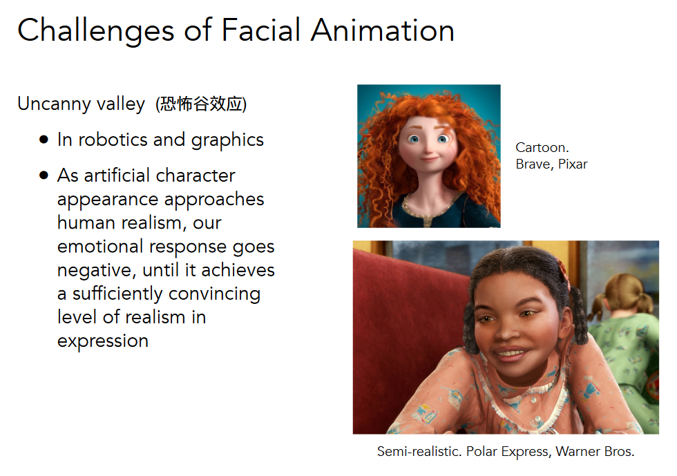

# Modern Graphics

It's a notebook of games-101

class link https://sites.cs.ucsb.edu/~lingqi/teaching/games101.html

## Course Topics

- Rasterization
  - Project geometry primitives (3D triangles/polygons) onto the screen
  - Break projected primitives into fragments (pixels)
  - Gold standard in video games (ream-time applications)
- Curves and Meshes
  - How to represent geometry in computer graphics
    - Bezier Curve
    - Catmull-Clark subdivision
- Ray Tracing
  - shoot rays from the camera though each pixel
    - calculate intersection and shading
    - continue to bounce the rays till they hit light sources
  - gold standard in animations/movies (off-line application)
- Animation/Simulation
  - key frame animation
  - mass-spring system

### Relations between computer graphics and computer vision?


## A Swift and Brutal Introduction to Linear Algebra

### Graphics' Dependencies

- Basic mathematics
  - Linear algebra,calculus,statistics
- Basic physics
  - optics, mechanics
- Misc
  - signal processing
  - numerical analysis

### Vectors

- usually written as $\vec{a}$ or in bold **a**
- or using start and end points $\vec{AB}=B-A$
- direction and length
- no absolute starting position

### Vector Normalization

- magnitude (length) og a vector written as $\left\| \vec{a} \right \|$
- unit vector
  - a vector with magnitude of 1
  - finding the unit vector of a vector (normalization) : $\hat{a}=\vec{a}/\left\| \vec{a} \right \|$
  - used to represent directions

### Vector Addition

- geometrically: parallelogram law & triangle law
- algebraically: simply add coordinates

### Vector Multiplication

- Dot product

  - $a\cdot b=\left\|a\right\|\left\|b\right\|cos \theta$
  - in graphics
    - find angle between two vectors (i.e. cosine of angle between light source and surface)
    - find projection of one vector on another
    - measures how close two directions are
    - decompose a vector
    - determine forward / backward
      - dot product > or < 0
  - dot product for projection
    - $\vec{b}_{\perp}$: projection of $\vec{b}$ onto $\vec{a}$
      - $\vec{b}_{\perp}$ must be along $\vec{a}$ (or along $\hat{a}$)
      - $\vec{b}_{\perp}=k \hat{a}$
    - what's its magnitude k?
      - $k=\left\|\vec{b}_{\perp}\right\|=\left\|\vec{b}\right\|cos \theta$

- Cross product

  - $a \times b=-b\times a$
  - $\vec{a}\times \vec{a}=\vec{0}$
  - $\vec{a}\times(\vec{b}+\vec{c})=\vec{a}\times\vec{b}+\vec{a}\times{c}$
  - $\vec{a}\times(k\vec{b})=k(\vec{a}\times\vec{b})$
  - $\left\|a\times b\right\|=\left\|a\right\|\left\|b\right\|sin\phi$
  - cross product is orthogonal to two initial vectors
  - direction determined by right-hand rule
  - useful in constructing coordinate systems (later)
  - properties (right handed coordinate)
    - $\vec{x}\times \vec{y}=+\vec{z}$
    - $\vec{y}\times \vec{x}=-\vec{z}$
    - $\vec{y}\times \vec{z}=+\vec{x}$
    - $\vec{z}\times \vec{y}=-\vec{x}$
    - $\vec{z}\times \vec{x}=+\vec{y}$
    - $\vec{x}\times \vec{z}=-\vec{y}$
  - Cartesian formula
  - $\vec{a}\times\vec{b}=\begin{pmatrix}y_az_b-y_bz_a\\z_ax_b-x_az_b\\x_ay_b-y_ax_b\end{pmatrix}=A*b=\underset{\text {dual matrix of vector a}}{\begin{pmatrix}0&-z_a&y_a\\z_a&0&-x_A\\-y_a&x_a&0\end{pmatrix}}\begin{pmatrix}x_b\\y_b\\z_b\end{pmatrix}$

  - in graphics
    - determine left / right
    - determine inside / outside
      - if a point is at the outside of shape, it will be locate at least at a vector's right

- Orthonormal bases and coordinate frames

  - important for representing points, positions, locations
  - often, many sets of coordinate systems
    - global,local,world,model,parts of model (head, hands, ...)
  - critical issue is transforming between these systems/bases
  - any set of 3 vectors (in 3D) that
    - $\left\|\vec{u}\right\|=\left\|\vec{v}\right\|=\left\|\vec{w}\right\|=1$
    - $\vec{u}\cdot\vec{v}=\vec{v}\cdot\vec{w}=\vec{u}\cdot\vec{w}=0$
    - $\vec{w}=\vec{u}\times\vec{v}$ (right-handed)
    - $\vec{p}=\underset{projection}{(\vec{p}\cdot\vec{u})}\vec{u}+(\vec{p}\cdot\vec{v})\vec{v}+(\vec{p}\cdot\vec{w})\vec{w}$

- Matrices

  - in graphics, pervasively used to represent transformations
    - translation, rotation, shear, scale
  - properties
    - transpose
      - $(AB)^T=B^TA^T$
    - non-commutative
      - AB and BA are different in general
    - associative and distributive
      - $(AB)C=A(BC)$
      - $A(B+C)=AB+AC$
      - $(A+B)C=AC+BC$

## Transformation

### scale matrix

$$\begin{bmatrix}x'\\y'\end{bmatrix}=\begin{bmatrix}s_x&0\\0&s_y\end{bmatrix}\begin{bmatrix}x\\y\end{bmatrix}$$

### reflection matrix

horizontal reflection

$$\begin{bmatrix}x'\\y'\end{bmatrix}=\begin{bmatrix}-1&0\\0&1\end{bmatrix}\begin{bmatrix}x\\y\end{bmatrix}$$

### shear matrix

$$\begin{bmatrix}x'\\y'\end{bmatrix}=\begin{bmatrix}1&a\\0&1\end{bmatrix}\begin{bmatrix}x\\y\end{bmatrix}$$

### rotate (about the origin (0,0), CCW by default)

$$R_\theta=\begin{bmatrix}cos\theta&-sin\theta\\sin\theta&cos\theta\end{bmatrix}$$

$$R_{-\theta}=\begin{bmatrix}cos\theta&sin\theta\\-sin\theta&cos\theta\end{bmatrix}=R^T_\theta=R^{-1}_\theta$$

### linear transforms = matrix (of the same dimension)

$$x'=Mx$$

### homogeneous coordinates

#### why choose homogeneous coordinates?

- translation cannot be represented in matrix form

- $x'=ax+by+t_x, y'=cx+dy+t_y$

- $\begin{bmatrix}x'\\y'\end{bmatrix}=\begin{bmatrix}a&b\\c&d\end{bmatrix}\begin{bmatrix}x\\y\end{bmatrix}+\begin{bmatrix}t_x\\t_y\end{bmatrix}$

- so, translation is not linear transform! 

  But we don't want translation to be a special case.

  Is there a unified way to represent all transformations? (and what's the cost?)

- add a third coordinate (w-coordinate)

  - 2D point = $(x,y,1)^T$
  - 2D vector = $(x,y,0)^T$
  - $\begin{pmatrix}x\\y\\w\end{pmatrix}$ is the 2D point $\begin{pmatrix}x/w\\y/w\\1\end{pmatrix}$, $w\ne 0$

- matrix representation of translations

  $$\begin{pmatrix}x'\\y'\\w'\end{pmatrix}=\begin{pmatrix}1&0&t_x\\0&1&t_y\\0&0&1\end{pmatrix}\cdot\begin{pmatrix}x\\y\\1\end{pmatrix}=\begin{pmatrix}x+t_x\\y+t_y\\1\end{pmatrix}$$

- valid operation if w-coordinate of result is 1 or 0

  - vector + vector =vector
  - point - point = vector
  - point + vector = point
  - point + point = the center between two points

#### affine transformations

- affine map = linear map + translation

  $\begin{pmatrix}x'\\y'\end{pmatrix}=\begin{pmatrix}a&b\\c&d\end{pmatrix}\cdot\begin{pmatrix}x\\y\end{pmatrix}+\begin{pmatrix}t_x\\t_y\end{pmatrix}$

- using homogeneous coordinates

  $\begin{pmatrix}x'\\y'\\1\end{pmatrix}=\begin{pmatrix}a&b&t_x\\c&d&t_y\\0&0&1\end{pmatrix}\cdot\begin{pmatrix}x\\y\\1\end{pmatrix}$

### 2D transformations

#### scale

$$S(s_x,s_y)=\begin{pmatrix}s_x&0&0\\0&s_y&0\\0&0&1\end{pmatrix}$$

#### rotation


$$R(\alpha)=\begin{pmatrix}cos\alpha& -sin\alpha &0\\sin\alpha & cos\alpha&0\\0&0&1\end{pmatrix}$$

#### translation

$$T(t_x,t_y)=\begin{pmatrix}1&0&t_x\\0&1&t_y\\0&0&1\end{pmatrix}$$

### composite transformation

#### transform ordering matters!!!

- if translate then rotate? or rotate then translate? --> rotate then translate is  correct

  $$T_{(1,0)}\cdot R_{45}\begin{bmatrix}x\\y\\1\end{bmatrix}=\begin{bmatrix}1&0&1\\0&1&0\\0&0&1\end{bmatrix}\begin{bmatrix}cos45^{\circ} &-sin45^{\circ} &0\\sin45^{\circ} &cos45^{\circ} &0\\0&0&1\end{bmatrix}\begin{bmatrix}x\\y\\1\end{bmatrix} $$

  **Note that matrices are applied right to left**

#### sequence of affine transforms $A_1,A_2,A_3...$

- compose by matrix multiplication
- $$A_n(...A_2(A_1(x)))=A_n...A_2\cdot A_1\cdot \begin{pmatrix}x\\y\\1\end{pmatrix}$$

### Decomposing complex transforms

#### Example : How to rotate around a given point c?

- translate center to origin
- rotate
- translate back

#### matrix representation?

$$T(c)\cdot R(\alpha)\cdot T(-c)$$

### 3D transformations

#### using homogeneous coordinates again

- 3D point = $(x,y,z,1)^T$
- 3D vector = $(x,y,z,0)^T$

in general, $(x,y,z,w)$ $(w\ne 0)$ is the 3D pont : $(x/w,y/w,z/w)$

use $4\times4$ matrices for affine transformations

$\begin{pmatrix}x'\\y'\\z'\\1\end{pmatrix}=\begin{pmatrix}a&b&c&t_x\\d&e&f&t_y\\g&h&i&t_z\\0&0&0&1\end{pmatrix}\cdot\begin{pmatrix}x\\y\\z\\1\end{pmatrix}$

#### what's the order?

linear first, then translation

## Transformation Cont.

### 3D transformations

#### scale

$$S(s_x,s_y,s_z)=\begin{pmatrix}s_x&0&0&0\\0&s_y&0&0\\0&0&s_z&0\\0&0&0&1\end{pmatrix}$$

#### translation

$$T(t_x,t_y,t_z)=\begin{pmatrix}1&0&0&t_x\\0&1&0&t_y\\0&0&1&t_z\\0&0&0&1\end{pmatrix}$$

#### rotation around x-, y-, or z-axis


$$R_x(\alpha)=\begin{pmatrix}1&0&0&0\\0&cos\alpha&-sin\alpha&0\\0&sin\alpha&cos\alpha&0\\0&0&0&1\end{pmatrix}$$

$$R_x(\alpha)=\begin{pmatrix}cos\alpha&0&sin\alpha&0\\0&1&0&0\\-sin\alpha&0&cos\alpha&0\\0&0&0&1\end{pmatrix}$$

$$R_x(\alpha)=\begin{pmatrix}cos\alpha&-sin\alpha&0&0\\sin\alpha&cos\alpha&0&0\\0&0&1&0\\0&0&0&1\end{pmatrix}$$

#### 3D rotations

compose any 3D rotation from $R_x,R_y,R_z$

$$R_{xyz}(\alpha,\beta,\gamma)=R_x(\alpha)R_y(\beta)R_z(\gamma)$$

- so-called Euler angles
- often used in flight simulator : roll,pitch, yaw


##### Rodrigues' rotation formula

- rotation by angle $\alpha$ around axis $n$

  $$R(n,\alpha)=cos(\alpha)I+(1-cos(\alpha))nn^T+sin(\alpha)\begin{pmatrix}0&-n_z&n_y\\n_z&0&-n_x\\-n_y&n_x&0\end{pmatrix}$$

**prove**


### viewing transformation

#### what's view transformation?

- think about how to take a photo?

  - find a good place and arrange people (model transformation)

  - find a good "angle" to put the camera (view transformation)

  - cheese! (projection transformation)

#### view / camera transformation

- how to perform view transformation?
- define the camera first
  - position $\vec{e}$
  - look-at / gaze direction $\hat{g}$
  - up direction $\hat{t}$ (assuming perp. to look-at)


- key observation
  - if the camera and all objects move together, the "photo" will be the same
- how about that we always transform the camera to 
  - the origin, up at Y, look at -Z
  - and transform the objects along with the camera
- transform the camera by $M_{view}$
- $M_{view}$ in math?
  - $M_{view}=R_{view}T_{view}$
    - $T_{view}=\begin{bmatrix}1&0&0&-x_e\\0&1&0&-y_e\\0&0&1&-z_e\\0&0&0&1\end{bmatrix}$
  - translate $e$ to origin
  - rotate $g$ to -Z, $t$ to Y, ($g\times t$) to X
    - but it's difficult to present
  - so consider its inverse rotation : X to ($g\times t$), Y to $t$, Z to $-g$ 
  - $$R^{-1}_{view}=\begin{bmatrix}x_{\hat{g}\times\hat{t}}&x_t&x_{-g}&0\\y_{\hat{g}\times\hat{t}}&y_t&y_{-g}&0\\z_{\hat{g}\times\hat{t}}&z_t&z_{-g}&0\\0&0&0&1\end{bmatrix}$$
  - because rotation matrix is orthogonal, so its inverse is its transposition matrix
  - $$R_{view}=\begin{bmatrix}x_{\hat{g}\times\hat{t}}&y_{\hat{g}\times\hat{t}}&z_{\hat{g}\times\hat{t}}&0\\x_t&y_t&z_t&0\\x_{-g}&y_{-g}&z_{-g}&0\\0&0&0&1\end{bmatrix}$$

### projection transformation


#### orthographic projection

- camera located at origin, looking at -Z, up at Y
- drop Z coordinate
- translate and scale the resulting rectangle to $[-1,1]^2$


- in general, we want to map a cuboid $[l,r]\times [b,t]\times[f,n]$ to the "canonical" cube $[-1,1]^3$
  - if something nearer to us , z's value will be samller


- transformation matrix

  - translate (center to origin) first, then scale (length/width/height to 2)

    $$M_{ortho}=\begin{bmatrix}\frac{2}{r-l}&0&0&0\\0&\frac{2}{t-b}&0&0\\0&0&\frac{2}{n-f}&0\\0&0&0&1\end{bmatrix}\begin{bmatrix}1&0&0&-\frac{r+l}{2}\\0&1&0&-\frac{t+b}{2}\\0&0&1&-\frac{n+f}{2}\\0&0&0&1\end{bmatrix}$$

- caveat

  - looking at / along -Z is making near and far not intuitive (n>f)
  - FYI : that's why OpenGL uses left hand coords

#### perspective projection


- most common projection
- further objects are smaller
- parallel lines not parallel
- coverage to single points

##### how to do perspective projection?

- first "squish" the frustum into a cuboid (n->n, f->f) ($M_{persp->ortho}$)
- do orthographic projection ($M_{ortho}$, already known!)


##### how to get transformation?

- recall the key idea : find the relationship between transformed points $(x',y',z')$ and the original points $(x,y,z)$
- $$y'=\frac{n}{z}y$$
- $$x'=\frac{n}{z}x$$


- in homogeneous coordinates

  $$\begin{pmatrix}x\\y\\z\\1\end{pmatrix}\rightarrow \begin{pmatrix}\frac{nx}{z}\\\frac{ny}{z}\\\text{unknown}\\1\end{pmatrix}=\begin{pmatrix}nx\\ny\\\text{still unknown}\\1\end{pmatrix}$$

- so the "squish" (persp to ortho) projection does this

  $$M^{(4\times4)}_{persp\rightarrow ortho}\begin{pmatrix}x\\y\\z\\1\end{pmatrix}=\begin{pmatrix}nx\\ny\\\text{unknown}\\1\end{pmatrix}$$

- already goog enough to figure out part of $M_{persp\rightarrow ortho}$

  $$M_{persp\rightarrow ortho}=\begin{pmatrix}n&0&0&0\\0&n&0&0\\?&?&?&?\\0&0&1&0\end{pmatrix}$$

- observation : the third row is responsible for z

  - any point on the near plane will not change

    $$M^{(4\times4)}_{persp\rightarrow ortho}\begin{pmatrix}x\\y\\z\\1\end{pmatrix}=\begin{pmatrix}nx\\ny\\\text{unknown}\\1\end{pmatrix}\underset{\text{replace z with n}}{\longrightarrow}\begin{pmatrix}x\\y\\n\\1\end{pmatrix}==\begin{pmatrix}nx\\ny\\n^2\\n\end{pmatrix}$$

    so the third row must be of the form $\begin{pmatrix}0&0&A&B\end{pmatrix}$

    $$\begin{pmatrix}0&0&A&B\end{pmatrix}\begin{pmatrix}x\\y\\n\\1\end{pmatrix}=n^2 (n^2\text{ has noting to do with x and y})$$

    $$An+b=n^2$$

  - any point's z on the far plane will not change

    $$\begin{pmatrix}0\\0\\f\\1\end{pmatrix}==\begin{pmatrix}0\\0\\f^2\\f\end{pmatrix}\rightarrow Af+B=f^2$$

- now we have two formulates and solve A and B

  $$\begin{matrix}An+B=n^2\\Af+B=f^2\end{matrix}\rightarrow\begin{matrix}A=n+f\\B=-nf\end{matrix}$$

- finally, every entry in $M_{persp\rightarrow ortho}$ is known

- what's next?

  - do orthographic projection ($M_{ortho}$) to finish
  - $M_{persp} = M_{ortho}M_{persp\rightarrow ortho}$

## Rasterization

### triangles

- sometimes people prefer : 

  vertical field-of-view (fovY) and aspect ratio (assume symmetry i.e. l = -r, b = -t)


- how to convert from fovY and aspect to l,r,b,t?
  - trivial


#### what's after MVP?

- Model transformation (placing objects)
- View transformation (placing camera)
- Projection transformation
  - orthographic projection (cuboid to "canonical" cube $[-1,1]^3$)
  - perspective projection (frustum to "canonical" cube)
- Canonical cube to screen
  - what's a screen?
    - an array of pixels
    - size of the array : resolution
    - a typical kind of raster display
  - raster == screen in german
    - rasterize == drawing onto the screen
  - pixel (FYI, short for "picture element")
    - color is a mixture of RGB
  - define the screen space
    - pixels' indices are in the form of (x,y), where both x and y are integers
    - pixels' indeices are form (0,0) to (width - 1, height - 1)
    - pixel (x,y) is centered at (x + 0.5, y + 0.5)
    - the screen covers range (0,0) to (width,height)


- transform in xy plane : $[-1,1]^2$ to [0, width] *[0,height]
- irrelevant to z
- viewport transform matrix

$$M_{viewport}=\begin{pmatrix}\frac{width}{2}&0&0&\frac{width}{2}\\0&\frac{height}{2}&0&\frac{height}{2}\\0&0&1&0\\0&0&0&1\end{pmatrix}$$

#### drawing to raster displays

- polygon meshes
- triangle meshes
  - why triangles?
    - most basic polygon
      - break up other polygons
    - uniques properties
      - guaranteed to be planar
      - well-defined interior
      - well-defined method for interpolating values at vertices over triangle (barycentric interpolation)

##### what pixel values approximate a triangle?


- input : position of triangle vertices projected on screen
- output : set of pixel values approximating triangle

###### a simple approach : sampling

evaluating a function at a point is sampling, we can discretize a function by sampling

```c++
for (int x = 0; x < xmax; ++x)
	output[x] = f(x);
```

sampling is a core idea in graphics, we sample time (1D), area (2D), direction (2D), volume (3D)

we can sample if each pixel center is inside triangle


- rasterization = sampling a 2D indicator function

  ```c++
  for (int x = 0; x < xmax; ++x)
      for (int y = 0; y < ymax; ++y)
          image[x][y] = inside(tri, x + 0.5, y + 0.5); // pixel center
  ```

- evaluating **inside (tri, x, y)**

  - how to judge a point inside?
    - three cross products
      - AB->BC->CA
    - edge cases
      - is this sample point covered by triangle 1, triangle 2, or both?
        - some software have different rules
  - how to make compute faster?
    - use a bounding box

- in this class, we assume display pixels emit square of light

but rasterization will be lead to **aliasing (jaggies)**


### antialiasing and Z-Buffering

sampling in graphics

- photograph = sample image sensor plane
- video = sample time

sampling **artifacts** -> (errors / mistakes / inaccuracies) in computer graphics

- aliasing - sampling in space
- moiré patterns in imaging - undersampling image
- wagon wheel illusion (false motion) - sampling in time

behind the aliasing artifacts

- signals are changing too fast (high frequency), but sampled too slowly

antialiasing idea

- blurring (pre-filtering) before sampling
- but sample then filter is WRONG!


but why?

- why undersampling introduces aliasing?
- why pre-filtering then sampling can do antialiasing?

#### frequency domain

cosine’s frequencies $cos2\pi f x$ where $f=\frac{1}{T}$


##### fourier transform

- represent a function as a weighted sum of sines and cosines


$$\text{fourier transform}F(\omega)=\int^{\infty}_{-\infty} f(x)e^{-2\pi i\omega x}dx$$

$\text{inverse transform}f(x)=\int^{\infty}_{-\infty}F(\omega)e^{2\pi i \omega x}d\omega,\text{where }e^{ix}=\cos x+i \sin x$

- higher frequencies need faster sampling, undersampling creates frequency aliases
- two frequencies that are indistinguishable at a given sampling rate are called “aliases”

##### **filtering = getting rid of certain frequency contents**


##### **filtering = convolution (= averaging)**

#### convolution


- convolution in the spatial domain is equal to multiplication in the frequency, and vice versa
- filter by convolution in the spatial domain
- transform to frequency domain (Fourier transform)
- multiply by Fourier transform of convolution kernel
- transform back to spatial domain (inverse Fourier)


##### **Sampling = Repeating frequency contents**


##### Aliasing = Mixed Frequency Contents


#### Antialiasing

##### how can we reduce aliasing error?

- option 1 : increase sampling rate
  - essentially increasing the distance between replicas in the Fourier domain
  - higher resolution displays, sensors, framebuffers ...
  - but : costly & may need very high resolution

- option 2 : antialiasing
  - making fourier contents “narrower” before repeating
  - i.e. filtering out high frequencies before sampling

##### antialiasing = Limiting, the repeating


##### antialiasing by averaging values in pixel area

solution : 

- convolve f(x,y) by a 1-pixel box-blur
  - recall : convolving = filtering = averaging
- then sample at every pixel’s center


##### Antialiasing By Supersampling (MSAA)


No free lunch!

- what’s the cost of MSAA?

Development Milestone

-  FXAA (fast approximate AA)
- TAA (temporal AA)

Super resolution / super sampling

- From low resolution to high resolution
- Essentially still “not enough samples” problem
- DLSS  (Deep Learning Super Sampling)

#### Visibility / occlusion

##### painter’s algorithm

inspired by how painters paint, paint from back to front, overwrite in the framebuffer

requires sorting in depth (O(n log n)) for n triangles

can have unresolvable depth order


#### Z-buffer

- store current min z-value for each sample (pixel)
- needs an additional buffer for depth values
  - frame buffer stores color values
  - depth buffer (z-buffer) stores depth
- for simplicity we suppose z is always positive (smaller z -> closer, larger z -> further)

##### Z-buffer algorithm

initialize depth buffer to $\infty$

during rasterization : 

```c++
for (each triangle T)
	for (each sample (x,y,z) in T)
		if (z < zbuffer[x,y])		//closest sample so far
			framebuffer[x,y] rgb;	//update color
			zbuffer[x,y] = z;		//update depth
         else
         	;						//do nothing, this sample is occluded
```


##### complexity

- O(n) for n triangles (assuming constant coverage)
  - why assume this state?
    - judge whether float values are equal is difficult
- how is it possible to sort n triangles in linear time
  - it’s wrong, there is not sorting operation

Drawing triangles in different orders?

most important visibility algorithm

- implemented in hardware for all GPUs

## Shading

### illumination, shading 

#### Definition

In this course shading is the process of applying a material to an object

#### A Simple Shading Model (Blinn-Phong Reflectance Model)

##### Perceptual observations


##### Shading is Local (at a specific shading point)


No shadows will be generated! (**shading ≠ shadow**)


##### Diffuse Reflection

- Light is scattered uniformly in all directions

  - surface color is the same for all viewing directions

    

- But how much light (energy) is received?

  - Lambert's cosine law

    


###### Lambertian (Diffuse) Shading


Produces diffuse appearance :


##### Specular Term

Intensity depends on view direction

- Bright near mirror reflection direction


$V$ close to mirror direction $\longleftrightarrow$  half vector near normal

- Measure "near" by dot product of unit vectors


###### why there is a power "p"?


##### Ambient Term

shading that does not depend on anything

- add constant color to account for disregarded illumination and fill in black shadows
- this is approximate / fake!


##### Blinn-Phong Reflection Model


#### shading frequencies


##### shade each triangle (Flat shading)

- triangle face is flat - one normal vector
- not good for smooth surfaces


##### shade each vertex (Gouraud shading)

- interpolate colors from vertices across triangle
- each vertex has a normal vector (how?)


##### shade each pixel (Phong shading)

- interpolate normal vectors across each triangle
- computer full shading model at each pixel
- not the Blinn-Phong Reflectance Model


##### Defining Per-Vertex Normal Vectors


### graphics (Real-time Rendering) Pipeline


##### shader programs

- program vertex and fragment processing stages
- describe operation on a single vertex (or fragment)


##### graphics pipeline implementation : GPUs - heterogeneous, multi-core processor

specialized processors for executing graphics pipeline computations


### Texture Mapping


#### Surfaces are 2D

- surface lives in 3D world space
- every 3D surface point also has a place where it goes in the 2D image (texture)


#### Interpolation Across Triangles: Barycentric Coordinates

Why do we want to interpolate?

- specify values at vertices
- obtain smoothly varying values across triangles

What do we want to interpolate?

- Texture coordinates, colors, normal vectors, ...

How do we interpolate?

- Barycentric coordinates


**Barycentric coordinates are not invariant under projection**

#### Applying Textures


#### Texture Magnification - Easy case  (What if the texture is too small?)


##### Bilinear Interpolation


Bilinear interpolation usually gives pretty good results
at reasonable costs


#### Texture Magnification - hard case (What if the texture is too large?)


#### Antialiasing - supersampling?

Will supersampling work?

- yes, high quality, but costly
- when highly minified, many texels in pixel footprint
- signal frequency too large in a pixel
- need even higher sampling frequency

Let's understand this problem in another way

- what if we don't sample?
- just need to get the average value within a range!


#### Mipmap - Allowing (fast, approx., square) range queries


##### limitations


#### Anisotropic Filtering - fix mipmap's overblur


#### Applications of textures

In modern GPUs, texture = memory + range query (filtering)

- General method to bring data to fragment calculations

Many applications

- Environment lighting
- Store microgeometry
- Procedural textures
- Solid modeling
- Volume rendering


##### Bump Mapping


###### How to perturb the normal (in flatland)


###### How to perturb the normal (in 3D)


##### Displacement Mapping


## Geometry

### Introduction


### Implicit representations


#### Algebraic Surfaces


#### Constructive Solid Geometry


#### Distance Functions


#### Blending Distance Functions


#### Level Set Methods


#### Fractals


#### Pros & Cons

- Pros
  - compact description (e.g., a function)
  - certain queries easy (inside object, distance of surface)
  - good for ray-to-surface intersection (more later)
  - for simple shapes, exact description / no sampling error
  - easy to handle changes in topology (e.g., fluid)
- Cons
  - difficult to model complex shapes

### Explicit representations


#### Point Cloud


#### Polygon Mesh


#### Curves

applications:

- camera paths
- animation curves
- vector fonts

##### Bezier Curves


###### Evaluating Bezier Curves (de Casteljau Algorithm)


###### Evaluation Bezier Curves Algebraic Formula


#### Piecewise Bezier Curves


example: http://math.hws.edu/eck/cs424/notes2013/canvas/bezier.html

##### Continuity


In this course 

- We do not cover B-splines and NURBS

- We also do not cover operations on curves
  (e.g. increasing/decreasing orders, etc.)
- To learn more deeper, you are welcome to refer to Prof. Shi-Min Hu’s course: https://www.bilibili.com/video/av66548502?from=search&seid=65256805876131485

#### Surfaces


##### Evaluating Bezier Surfaces


#### mesh operations


##### mesh subdivision (upsampling)


###### loop subdivision


###### catmull-clark subdivision


##### mesh simplification (downsampling)


http://graphics.stanford.edu/courses/cs468-10-fall/LectureSlides/08_Simplification.pdf


##### mesh regularization (same # of triangles)


### Shadow Mapping


floating numbers' comparison is difficulty!


https://www.timeanddate.com/eclipse/umbra-shadow.html

## Ray tracing


### Basic Ray-Tracing Algorithm


#### Ray-Surface Intersection


### Accelerating Ray-Surface Intersection


#### Bounding Volumes


#### Uniform Spatial Partitions (Grids)


#### Spatial Partitions


#### Object Partitions & Bounding Volume Hierarchy (BVH)


### Basic radiometry


#### Radiant Energy and Flux (Power)


#### Radiant Intensity


#### Irradiance


The differential solid angle is not change, so what really falloff is irradiance neither intensity.

#### Radiance


##### Irradiance VS Radiance


#### Bidirectional Reflectance Distribution Function (BRDF)


### Light transport

#### Understanding the rendering equation


### Global illumination


### Probability Review


### Monte Carlo Integration


### Path Tracing


http://www.graphics.cornell.edu/online/box/compare.html


## Materials and Appearances


### Material == BRDF


### Microfacet Material


### Measuring BRDFs


## Advanced Light Transport


### Unbiased light transport methods


### Biased light transport methods


### Instant radiosity (VPL / many light methods)


## Advanced Appearance Modeling


### Non-surface models


### Surface models


### Procedural appearance


## Cameras, Lenses and Light Fields

### Imaging = Synthesis + Capture


### Pinhole Image Formation


### Filed of View (FOV)


### Exposure


### Fast and Slow Photography


### Thin Lens Approximation


http://graphics.stanford.edu/courses/cs178-10/applets/gaussian.html

### Defocus Blur


### Ray Tracing Ideal Thin Lenses


### Depth of Field


http://graphics.stanford.edu/courses/cs178/applets/dof.html

### Light Field / Lumigraph


#### Light Field Camera


### Color

#### What is color ?

##### Physical Basis of Color


##### Biological Basis of Color


#### Color perception

##### Tristimulus Theory of Color


##### Metamerism (同色异谱)


#### Color reproduction / matching


#### Color space


#### Perceptually Organized Color Spaces


## Animation


### Historical Points in Animation


### Keyframe Animation


### Physical Simulation


#### Mass Spring System: Example of Modeling a Dynamic System


### Particle Systems


### Kinematics

#### Forward Kinematics


#### Inverse Kinematics


### Rigging


### Motion Capture





## Simulation

### Single particle simulation


#### Combating Instability


### Rigid body simulation


### Fluid simulation


